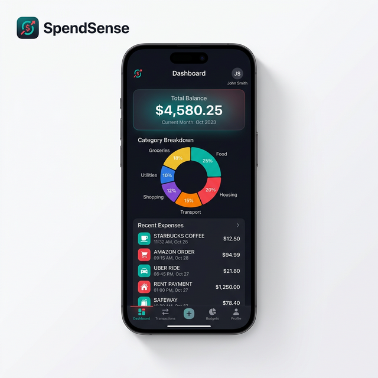

<div align="center">
  
  <h1>SpendSense</h1>
  <p><b>Smart Expense Tracking System</b></p>

  <p>
    
    
    
    
    
  </p>

  <p><i>Effortlessly manage your finances with a sleek mobile experience and a robust backend.</i></p>
</div>

<hr />

## 🌟 Features

- **🔐 Secure Authentication**: JWT-based login and registration for maximum security.
- **💸 Expense Management**: Quickly add, update, or delete expenses with a few taps.
- **🏷️ Dynamic Categories**: Organize spending into custom categories with inline creation.
- **📊 Real-time Analytics**: Visualize your spending habits with monthly and category-based breakdowns.
- **📱 Premium Dark UI**: A stunning, modern interface designed for focus and clarity.
- **🚀 Cross-Platform**: Built with React Native and Expo for a seamless experience on Android and iOS.

<!-- <div align="center">
  <h3>📱 App Mockup</h3>
  
</div> -->

## 🛠️ Tech Stack

### Backend API
- **Java 17 & Spring Boot 3**: High-performance RESTful API.
- **Spring Security + JWT**: Stateless authentication.
- **Spring Data JPA**: Efficient database interactions.
- **MySQL**: Reliable data persistence.
- **Lombok**: Clean and concise code.

### Mobile App
- **React Native & Expo**: Robust cross-platform development.
- **React Navigation**: Smooth screen transitions.
- **Axios**: Promised-based HTTP client for API sync.
- **Context API**: Efficient state management.
- **Async Storage**: Fast local data persistence.

## 🚀 Getting Started

### Prerequisites
- JDK 17
- Maven
- Node.js & npm
- Expo Go app (on your mobile device)

### Backend Setup
1. Navigate to the root directory.
2. Configure your MySQL credentials in `src/main/resources/application.properties`.
3. Run the application:
   ```bash
   ./mvnw spring-boot:run
   ```

### Mobile Setup
1. Navigate to the `mobile` directory:
   ```bash
   cd mobile
   ```
2. Install dependencies:
   ```bash
   npm install
   ```
3. Start the Expo server:
   ```bash
   npx expo start
   ```
4. Scan the QR code using the Expo Go app to launch the app!

## 📜 Documentation
For a detailed look at the project architecture, file structures, and method signatures, check out our [In-depth Project Documentation](PROJECT_DOCUMENTATION.md).

---

<p align="center">Built with ❤️ by Aryan Kumar</p>
